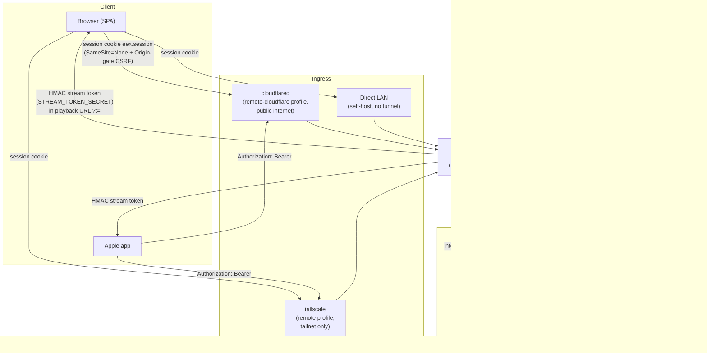

# Architecture

This document describes the runtime shape of The Emerald Exchange: what each service is, how
requests and trust flow between them, where data lives, and how a build gets from a commit to
the NAS. It is a companion to `README.md` (product/dev-setup framing) and `DEPLOY.md` (the full
deploy runbook), this file stays close to the code that implements the topology.

Two deploy tracks exist, both built from the same images and the same `server/`, `crates/`, and
`recommender/` source:

- **Self-host** (`selfhost/docker-compose.yml`), pulls prebuilt multi-arch GHCR images, runs the
  4 core services (`backend`, `media-core`, `transcoder`, `recommender`) on a LAN, no build step.
- **Owner full deployment** (root `docker-compose.yml`), builds the same services locally on the
  NAS, adds the `remote-cloudflare` / `remote` / `telemetry` profiles, and splits the SPA out to
  Netlify instead of bundling it into the backend image.

## 1. Services

- **Web client (SPA)**, React 19 + Vite + TypeScript, entry `src/main.tsx` (README.md:111-112).
  It is always a static bundle; who serves it differs by track. The owner deployment builds the
  backend image with `BUNDLE_SPA=off` (`Dockerfile:29`) and serves the SPA from Netlify
  (`server/app.ts:328-331`, `server/env.ts` `serveSpa` auto-detects `./dist/index.html` and stays
  off when the image ships none, `server/env.ts:113-116`). The self-host GHCR backend image is
  built with `BUNDLE_SPA=on` (`.github/workflows/publish-images.yml:10,50`), which bakes a Vite
  `dist/` into the image (`Dockerfile:95-120,201-204`); the backend then serves it same-origin at
  `http://<host>:3001` (`selfhost/docker-compose.yml:7`, `server/app.ts:334-339`).

- **Backend**, Hono + TypeScript (`server/`), entry `server/index.ts`, wiring in `server/app.ts`.
  Owns auth/authorization, the `*arr`/SAB/IPTV/DVR bridges, TMDB lookups, the recommender and
  media-core/transcoder proxies, telemetry DSN distribution, and the SQLite data layer
  (`server.db`, `media.db` read path, `iptv.db`). Global middleware, in the order `app.ts` applies
  it: `requestId()` (`server/app.ts:73`), a 1 MiB body-size cap on the `/api/media/*` and
  `/api/transcode/*` control-plane routes (`server/app.ts:79-88`), a frame-ancestors/X-Frame-Options
  header pass (`server/app.ts:93-97`), a redacting request logger (`server/app.ts:104-119`), CORS
  built from `env.allowedOrigins` when non-empty (`server/app.ts:124-147`), and the CSRF/Origin gate
  `requireSafeOrigin` (`server/app.ts:153`, implemented in `server/middleware/csrf.ts`). Routes are
  mounted from line 235 onward; `/api/media` and `/api/transcode` are conditionally mounted only
  when `USE_MEDIA_CORE=1` (`server/app.ts:319-326`), and `/api/iptv`/`/api/dvr` are gated on
  `IPTV_DISABLED`/`DVR_ENABLED` (`server/app.ts:268-275`).

- **media-core** (`crates/media-core`, Rust/Axum), scans a read-only media library into
  `media.db`, serves `/api/media/*` to the backend, and on a transcode-required file forwards to
  the transcoder (`docker-compose.yml:296-366`). It binds `0.0.0.0` inside its container; the host
  publish is loopback-only. `crates/media-core/src/main.rs:1-67` shows the boot sequence: load
  `Config::from_env()`, connect `Db`, build the router, start the boot/periodic library scanner
  (`spawn_scheduler`), then serve with graceful shutdown on SIGTERM or SIGINT
  (`crates/media-core/src/main.rs:69-107`).

- **transcoder** (`crates/transcoder`, Rust/Axum), runs ffmpeg-backed HLS transcode sessions for
  files that cannot direct-play. `crates/transcoder/src/main.rs:1-60` detects which hardware
  encoder ffmpeg actually has compiled in and working (`encoders::detect(...).validate(...)`),
  resolves the configured `TRANSCODER_HW_ENCODER` against that (falling back to CPU/libx264 if the
  configured one isn't usable), and only then builds `AppState` and starts serving. It shares the
  same read-only `/media` mount as media-core and writes HLS segments to a durable `/scratch`
  volume, never a RAM tmpfs (`docker-compose.yml:434-448`).

- **recommender** (`recommender/`, Python/FastAPI), local-first scoring/recommendation sidecar.
  `recommender/app/main.py:1-4` states its own trust model directly: "the Hono backend hits these
  endpoints; the public-facing tunnel is not configured for this service. All requests are inside
  the Docker network." It exposes `/health`, `/metrics/funnel`, `/score`, and a family of
  `/events/*` write endpoints (`recommender/app/main.py:143-491`) backed by a sqlite-vec store.

- **cloudflared**, the only public-internet-facing container in the owner deployment, gated
  behind the `remote-cloudflare` profile (`docker-compose.yml:498-502`). It joins the backend's
  network namespace (`network_mode: service:backend`) rather than the host's, specifically so a
  compromised tunnel image cannot reach the loopback-only admin ports of the other sidecars
  (`docker-compose.yml:510-522`).

- **tailscale**, private remote access via Tailscale Serve, gated behind the `remote` profile in
  both compose files (`docker-compose.yml:533-568`, `selfhost/docker-compose.yml:194-219`). Exposes
  the backend at `https://<TS_HOSTNAME>.<tailnet>.ts.net` to tailnet devices only, never the public
  internet. Same `network_mode: service:backend` pattern as cloudflared, userspace networking (no
  `NET_ADMIN`, no `/dev/net/tun`).

- **Glitchtip telemetry stack**, `glitchtip`, `glitchtip-db` (Postgres 15), `glitchtip-redis`
  (Valkey), `glitchtip-worker`, all under the `telemetry` profile
  (`docker-compose.yml:570-793`). Opt-in and owner-deployment-only; the self-host bundle has no
  telemetry containers at all. Every telemetry-enabled deployment runs its own Glitchtip instance
 , crash data never leaves the self-hoster's infrastructure (`docker-compose.yml:570-577`).

## 2. Ports

Owner deployment (`docker-compose.yml`):

| Service | Container port | Host publish | Reachability |
| --- | --- | --- | --- |
| backend | 3001 | `127.0.0.1:3001` | loopback-only (`docker-compose.yml:63-64`) |
| recommender | 8000 | `127.0.0.1:8001` | loopback-only, admin debugging (`docker-compose.yml:247-248`) |
| media-core | 8002 | `127.0.0.1:8002` | loopback-only (`docker-compose.yml:335-336`) |
| transcoder | 8003 | `127.0.0.1:8003` | loopback-only (`docker-compose.yml:432-433`) |
| glitchtip | 8000 (in-container) | `127.0.0.1:8100` | loopback-only (`docker-compose.yml:620-622`) |
| cloudflared | n/a | none (`network_mode: service:backend`) | terminates the public Cloudflare Tunnel; reaches the backend at `localhost:3001` inside the shared netns (`docker-compose.yml:522`) |
| tailscale | n/a | none (`network_mode: service:backend`) | tailnet-only via Tailscale Serve |

recommender, media-core, transcoder, and glitchtip-db/redis have no path to the public internet;
the only container with an internet-facing listener is cloudflared, and only when the
`remote-cloudflare` profile is enabled.

Self-host bundle (`selfhost/docker-compose.yml`):

| Service | Container port | Host publish | Reachability |
| --- | --- | --- | --- |
| backend | 3001 | `3001` (all interfaces) | **LAN-reachable by design**, no tunnel in front (`selfhost/docker-compose.yml:41-44`); the comment there notes changing it to `127.0.0.1:3001:3001` if the operator only ever uses the `remote` profile |
| media-core, transcoder, recommender | 8002/8003/8000 | none published | reachable only over the compose network, from the backend |
| tailscale | n/a | none (`network_mode: service:backend`) | opt-in private remote access |

## 3. Trust boundaries

Four independent credential mechanisms, plus one narrow export secret:

- **Session cookie** (member/admin browser auth), cookie name `eex.session`
  (`server/session.ts:51`). Minted via `jose`'s `EncryptJWT`/`jwtDecrypt` (`server/session.ts:35,367`),
  keyed off `SESSION_SECRET` (`server/env.ts`, required always, production-gated for length and
  against a placeholder deny-list, `server/env.ts:205-253`). `SameSite=None` in production for the
  split Netlify↔NAS deployment, which is why the CSRF/Origin gate (`requireSafeOrigin`,
  `server/middleware/csrf.ts`) exists as the actual state-changing-request defense
  (`server/app.ts:90-92,149-153`).

- **Device bearer token** (Apple app pairing), presented as `Authorization: Bearer <token>` and
  read by `tryBearerAuth` (`server/middleware/deviceTokenAuth.ts`, wired in
  `server/middleware/auth.ts:20,34`). Backed by `DEVICE_TOKEN_SECRET`, used as HKDF input-key-material
  with info label `eex/device-token/v1` (`crates/emerald-contracts/README.md:19`) to derive a
  32-byte AES-256-GCM key (`server/env.ts:267-277`). 180-day TTL, `kid` `device-v1`
  (`crates/emerald-contracts/README.md:25`).

- **HMAC stream tokens** (media/IPTV playback URLs), signed and verified with
  `STREAM_TOKEN_SECRET` via `signStreamToken`/`verifyStreamToken`
  (`server/services/mediaStreamToken.ts:20-21,41-46,66-72`). Deliberately **not** HKDF-derived:
  the contract README states stream tokens HMAC the raw UTF-8 bytes of `STREAM_TOKEN_SECRET`
  directly (`crates/emerald-contracts/README.md:36-39`), kept as a separate secret from
  `SESSION_SECRET` specifically so a stream-token compromise cannot expose session cookies
  (`server/env.ts:255-266`). Local-media tokens default to a 6-hour TTL
  (`MEDIA_STREAM_TOKEN_TTL_SECS`, `server/env.ts:726`), IPTV on-demand tokens to 6 hours
  (`IPTV_ONDEMAND_TOKEN_TTL_SECS`, `server/env.ts:720`) and IPTV live tokens to 12 hours
  (`IPTV_LIVE_TOKEN_TTL_SECS`, `server/env.ts:706`), because a single token is re-presented on
  every byte-range/HLS-segment fetch for the length of a viewing session.

- **Internal principal** (backend → media-core / transcoder / recommender), a 60-second JWE the
  backend mints on every outbound sidecar call (`server/services/internalPrincipal.ts:1-33`,
  `INTERNAL_PRINCIPAL_TTL_SECS = 60`), keyed by `INTERNAL_PRINCIPAL_SECRET` HKDF'd with info label
  `eex/internal-principal/v1` (`crates/emerald-contracts/README.md:20,26`). It is presented as an
  `Authorization: Bearer <jwe>` header (`server/routes/media.ts:118-123`) and carries `sub`,
  `role`, `auth_mode`, `server_id`, `device_id`, `iat`/`exp`, `req_id`, `iss`
  (`recommender/app/internal_principal.py:53-63`). Each receiving service verifies it independently
  through the shared Rust crate, media-core and transcoder via native Rust, recommender via the
  PyO3 binding (`recommender/app/internal_principal.py:1-20`), with a `mode` knob (`off` / `log` /
  `enforce`) that defaults to `enforce` in the compose files
  (`docker-compose.yml:276-283,356-357,472-477`, `selfhost/docker-compose.yml:132,167,190`). In
  `enforce` mode the receiver 401s on a missing/invalid header and refuses to boot at all if
  `INTERNAL_PRINCIPAL_SECRET` is unset (`recommender/app/internal_principal.py:38-49`).
  `SESSION_SECRET`, `STREAM_TOKEN_SECRET`, `DEVICE_TOKEN_SECRET`, and `INTERNAL_PRINCIPAL_SECRET`
  are asserted pairwise-distinct at backend boot in every environment
  (`server/env.ts:293-302`, `assertSecretsDistinct`).

- **Recommender event secret**, `RECOMMENDER_EVENT_SECRET`, a flat shared secret (not HKDF'd,
  not a JWE) checked via `hmac.compare_digest` against the `X-Recommender-Secret` header on the
  recommender's write endpoints (`recommender/app/main.py:110-116`,
  `require_event_secret`/`x_recommender_secret`). Required whenever `USE_LOCAL_RECOMMENDER=1`
  (`server/env.ts:449-453`), production-gated against the same placeholder deny-list as
  `SESSION_SECRET` (`server/env.ts:253`, `recommender/app/config.py:8-21`). It sits alongside, not
  instead of, the internal-principal check, the recommender's `/events/*` routes can require both.

- One more narrow secret worth naming: `IPTV_RECOMMENDER_EXPORT_SECRET`, checked in
  `server/routes/iptv/admin.ts` and unrelated to the four boundaries above, it gates a single IPTV
  catalog-export endpoint the recommender pulls from the backend, distinct from
  `RECOMMENDER_EVENT_SECRET`.

## 4. Data stores

| Store | Path | Owner | Notes |
| --- | --- | --- | --- |
| `server.db` | `SERVER_DB_PATH`, default `./data/server.db` (`server/env.ts:664`); mounted at `/app/data` in both compose files | backend | sessions/invites/members/settings/watchlist; `server/services/serverDb.ts` singleton; probed by `/api/health` (`server/app.ts:162-170`) |
| `media.db` | `MEDIA_DB_PATH`, default `./data/media.db` (`server/env.ts:649`, `crates/media-core/src/config.rs:151`) | media-core (writer), backend (read-only via a shared bind mount) | owner deployment mounts media-core's live DB directory straight into the backend container at `/media-core-db` specifically so the backend's availability tagger and `/api/version` schema probe never see a stale copy (`docker-compose.yml:69-74`); self-host shares it via the `media-core-db` named volume (`selfhost/docker-compose.yml:46-47,123-124`) |
| `iptv.db` | `IPTV_DB_PATH`, default `./data/iptv.db` (`server/env.ts:665`); `/app/data/iptv.db` in both composes | backend | Xtream/IPTV channel and EPG cache (`server/services/iptvSync.ts`); lives inside the same `backend-data`/appdata volume as `server.db` |
| recommender sqlite-vec DB | `RECOMMENDER_DB_PATH`, default `./data/exchange.db` (`recommender/app/config.py:161`); `/data/exchange.db` in both composes | recommender | SQLite with the `sqlite-vec` extension loaded at connect time (`recommender/app/db.py:1-10,315-317`); the `title_vec` `vec0` virtual table holds title embeddings (`recommender/app/db.py:62`) |
| transcoder scratch | `TRANSCODER_TMP_DIR` = `/scratch`, backed by a durable disk bind mount (owner) or a named volume `transcoder-scratch` (self-host), **not** a RAM tmpfs, VOD sessions retain every HLS segment for full-title seek (`docker-compose.yml:434-448`) | transcoder | idle sessions are reaped 30s after the last heartbeat; also swept on boot |
| Glitchtip Postgres/Valkey | `glitchtip-pgdata` / in-memory Valkey | glitchtip stack | owner-deployment-only, `telemetry` profile |

## 5. emerald-contracts: one crypto contract, three runtimes

`crates/emerald-contracts` is the single Rust source of truth for token formats, HKDF key
derivation, `sub` (identity) parsing, and the PII-scrub denylist used by telemetry
(`crates/emerald-contracts/README.md:1-7`). Two bindings expose it to the other two languages
without re-implementing any of that logic:

- **`@emerald/contracts-napi`** (N-API, `crates/emerald-contracts-napi/`), the backend imports
  this instead of hand-rolling HKDF/HMAC with `jose`/`node:crypto`
  (`crates/emerald-contracts-napi/src/lib.rs:1-6`). It exposes `hkdf_session`,
  `hkdf_device_token`, `hkdf_internal_principal`, plus generic HKDF, stream-token, device-token,
  sub-parsing, and PII-scrub functions (`crates/emerald-contracts-napi/src/lib.rs:18-56`). Because
  Hono is the party that *mints* internal-principal tokens (never verifies them), the N-API surface
  intentionally omits the verify side.
- **`emerald_contracts`** (PyO3, `crates/emerald-contracts-pyo3/`), the recommender imports this
  as a native Python extension module. Its surface is narrower than N-API's: HKDF, sub parsing, PII
  scrub, and the internal-principal *verify* side (`internal_principal_decrypt` /
  `_enforce_time_window`), because the recommender only ever receives principals, never mints them
  (`crates/emerald-contracts-pyo3/src/lib.rs:1-16`).

Frozen wire values that both bindings and the Rust core agree on (from
`crates/emerald-contracts/README.md:14-27`): HKDF info strings `eex/session/v1`,
`eex/device-token/v1`, `eex/internal-principal/v1`; `sub` regexes per provider (Plex, local,
Apple, Google); device-token TTL 180 days / `kid` `device-v1`; internal-principal TTL 60s / `kid`
`internal-v1`; stream-token verify skew of `nbf +30s`, `exp -5s`. The README calls out explicitly
that renaming an HKDF info string silently rotates every key derived under that label, it isn't
caught by any test.

`tests/vectors/` holds the interop oracle: `stream-token-canonical.json`, `sub-namespace.json`,
`telemetry-pii-scrub.json`, `device-token-kid-rotation.json`, `internal-principal.json`,
`hkdf-parity.json`, plus `show-title-normalization.json`. The Rust crate's own test suite loads
six of these seven vectors (`crates/emerald-contracts/README.md:9-12`, citing
`tests/vectors.rs:43,81,116,133,205,288`), and CI gates both the Rust side and the N-API↔PyO3
cross-binding on the same fixtures (`.github/workflows/ci.yml:314`, `:250-257`), meaning a single
JSON file of expected inputs/outputs is the thing that proves Rust, the Node addon, and the Python
extension module all derive byte-identical keys and produce byte-identical token/sub/scrub
behavior, rather than three implementations that merely agree by convention.

## 6. Deploy path

**Self-host quickstart**, `./install.sh` (or `sh scripts/self-host-env.sh && docker compose up -d`
per `selfhost/docker-compose.yml:15`) pulls the four prebuilt GHCR images
(`ghcr.io/chrispachulski/theemeraldexchange-{backend,media-core,transcoder,recommender}`), no
local build. The operator sets `MEDIA_PATH` (required, the compose file hard-fails with `:?set
MEDIA_PATH in .env...` if it's missing, `selfhost/docker-compose.yml:125,150`) and, after first
boot, sets `ADMIN_SUBS` to their own provider sub and restarts to claim ownership
(`selfhost/docker-compose.yml:16-17`). `remote` (Tailscale) is the only optional profile in this
bundle; there is no self-host equivalent of `remote-cloudflare` or `telemetry`.

**Owner full deployment**, `scripts/deploy-nas.sh` (634 lines) drives it end to end:

1. Refuses to run outside a git repo and warns if the working tree is dirty, because **the deploy
   payload is always `git archive HEAD`**, never the working tree (`scripts/deploy-nas.sh:14-17,65-69`)
  , uncommitted edits silently do not ship.
2. Stages that archive into a temp dir and `rsync`s the build context (Dockerfile, compose file,
   package manifests, the full `crates/` workspace, `deploy/`, the prebuilt `eex-ytresolve`
   binary, and the laptop's `.env.production` as `.env`, chmod 600) to the NAS's appdata root
   (`scripts/deploy-nas.sh:204-324`).
3. Before building, snapshots the NAS's current `docker-compose.yml` and `.env` as
   `<file>.rollback-<timestamp>`, and tags every currently-deployed image as
   `:rollback-<timestamp>`, keeping the newest 2 generations of each and pruning older ones
   (`scripts/deploy-nas.sh:240-256,349-371`). This is a config-and-image rollback, not image-only.
4. Builds with `EEX_RELEASE=<short sha>` and brings the stack up with `docker compose up -d
   --no-build` (`scripts/deploy-nas.sh:389-398`).
5. Force-recreates `cloudflared` after the backend recreate, since its `network_mode:
   service:backend` reference goes stale whenever the backend container is replaced
   (`scripts/deploy-nas.sh:406-424`, mirroring the comment at `docker-compose.yml:520-521`).
6. **Health gate**: polls `docker inspect` health status for `exchange-backend`,
   `exchange-recommender`, `exchange-media-core`, and `exchange-transcoder` for up to ~150s
   (`scripts/deploy-nas.sh:571-609`), every core service must report `healthy`, not just the
   backend. Telemetry containers are checked too but only as a WARN, never a deploy-failing
   condition (`scripts/deploy-nas.sh:566-579`).
7. **On health-gate failure**: restores the snapshotted compose file and `.env`, re-tags the
   `:rollback-<timestamp>` images back to `:latest`, brings the stack back up, force-recreates
   `cloudflared` again, and then **re-runs the identical health gate** against the rolled-back
   stack, a rollback is only reported as a recovery if it, too, comes back healthy
   (`scripts/deploy-nas.sh:611-668`).
8. **Release-drift check**: after a healthy gate, curls the NAS loopback `/api/version` and
   compares its `release` field against the short SHA this run shipped, failing loudly on a
   mismatch (a healthy-but-wrong-build state) rather than declaring success on health alone
   (`scripts/deploy-nas.sh:596-620`).
9. Prunes BuildKit cache (`--keep-storage 10GB`, preserving the cargo/target cache mounts) and
   dangling images to bound the per-deploy disk creep (`scripts/deploy-nas.sh:622-628`).

**`scripts/nas-safe-build.sh`** exists because a raw `docker compose build`/`up --build` on the
NAS is a cold, full-workspace Rust compile that has twice driven load high enough to brown out
Plex on the same 6-thread box (`scripts/nas-safe-build.sh:8-11`). Instead it: discovers CPU
capacity at run time rather than hardcoding it; runs the build **detached** on the NAS
(`setsid` + logfile + done-sentinel) so a dropped SSH session can't orphan it; prints a periodic
heartbeat so a slow-but-alive build is distinguishable from a hung one; and runs two independent
watchdogs, an on-NAS one (fork-free, reads `/proc` directly, so it still fires even when the box
is too starved for `fork()`/`sshd` to work) and a Mac-side SSH watchdog as a second layer, that
abort the build the moment the named critical container (Plex by default) goes unhealthy, 1-minute
load-per-core exceeds a threshold for several consecutive samples, or available memory collapses
(`scripts/nas-safe-build.sh:1-53`). A built image is then swapped in with `docker compose up -d
--no-build <service>`, seconds, no compile.

## 7. Request/trust flow

